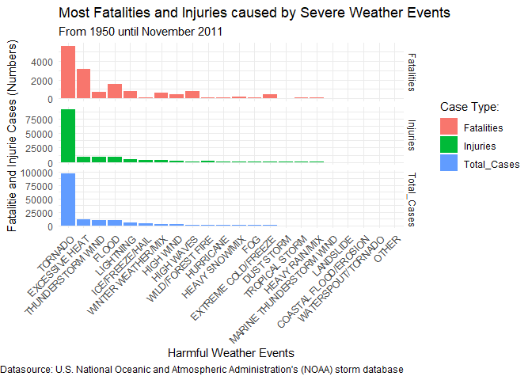
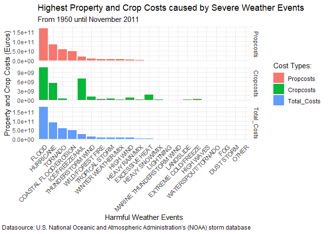
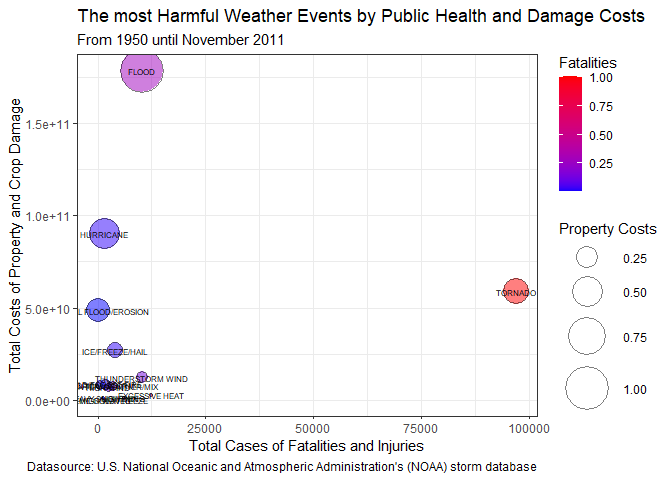

Impact of extreme weather events for public health and damage costs in the United States
Reproductible Research Project2 - Data Science Specialization
---------------------------

## Synopsis

The purpose of this assignment is to explore the NOAA Storm Database and
answer some basic questions about severe weather events and their impact
on public health and economy in the United Stats from 1950 and until
2011. Comparing severe weather events regarding their fatalities and
injuries number and their property and crop costs can help us develop
better preventing and saving measures. Tornado produce the most
fatalities and flood damage the properties the most. After these,
excessive heat and thunderstorm wind as well as hurricanes, coastal
flood and ice or hail should be also considered.

## Introduction

Tornado and other severe weather events can cause both public health and
economic problems for communities and municipalities. Many severe events
can result in fatalities, injuries, and property damage, and preventing
such outcomes to the extent possible is a key concern. This study is a
comparison of most severe weather events that cause the most fatalities
and injuries numbers and also the most property and crop damage costs.

## The Data

This project involves exploring the U.S. National Oceanic and
Atmospheric Administration’s (NOAA) storm database. This database tracks
characteristics of major storms and weather events in the United States,
including when and where they occur, as well as estimates of any
fatalities, injuries, and property damage.

The events in the database start in the year 1950 and end in November
2011. In the earlier years of the database there are generally fewer
events recorded, most likely due to a lack of good records. More recent
years should be considered more complete.

The data used for this analysis (U.S. National Oceanic and Atmospheric
Administration’s (NOAA) storm database) can be found here [Storm
Data](https://d396qusza40orc.cloudfront.net/repdata%2Fdata%2FStormData.csv.bz2).

This analysis was conducted in *RStudio*. The final R Markdown Report
was compiled with the help of knitr package to HTML and PDF.

## Data Processing

First we need to load, clean and transform the data before we can
analyse it. In this section are described the data preprocessing steps.

### Read and understand the Data

The data was first downloaded, unzipped and than loaded into RStudio
using the above mentioned source link.

    #Install the following packages outside the Rmd document, or before knitr
    #install.packages("R.utils")
    #install.packages("dplyr")
    #install.packages("data.table")
    #install.packages("plyr")

    #Than load the libraries 
    library(R.utils)
    library(dplyr)
    library(data.table)
    library(plyr)

    #Download and unzip the data.
    url <- "https://d396qusza40orc.cloudfront.net/repdata%2Fdata%2FStormData.csv.bz2"
    download.file(url, dest="storm.csv.bz2", mode="wb") 
    bunzip2('storm.csv.bz2', 'storm.csv', skip = TRUE)

The data frame contains 902297 observations and 37 features.

    #Read the data and show the dimension of the data frame.
    storm_df <- read.csv("storm.csv")
    dim(storm_df)

    ## [1] 902297     37

Let’s see the first 6 rows of the data.

    #Read the data and show the first 6 rows.
    head(storm_df)

    ##   STATE__           BGN_DATE BGN_TIME TIME_ZONE COUNTY COUNTYNAME STATE  EVTYPE
    ## 1       1  4/18/1950 0:00:00     0130       CST     97     MOBILE    AL TORNADO
    ## 2       1  4/18/1950 0:00:00     0145       CST      3    BALDWIN    AL TORNADO
    ## 3       1  2/20/1951 0:00:00     1600       CST     57    FAYETTE    AL TORNADO
    ## 4       1   6/8/1951 0:00:00     0900       CST     89    MADISON    AL TORNADO
    ## 5       1 11/15/1951 0:00:00     1500       CST     43    CULLMAN    AL TORNADO
    ## 6       1 11/15/1951 0:00:00     2000       CST     77 LAUDERDALE    AL TORNADO
    ##   BGN_RANGE BGN_AZI BGN_LOCATI END_DATE END_TIME COUNTY_END COUNTYENDN
    ## 1         0                                               0         NA
    ## 2         0                                               0         NA
    ## 3         0                                               0         NA
    ## 4         0                                               0         NA
    ## 5         0                                               0         NA
    ## 6         0                                               0         NA
    ##   END_RANGE END_AZI END_LOCATI LENGTH WIDTH F MAG FATALITIES INJURIES PROPDMG
    ## 1         0                      14.0   100 3   0          0       15    25.0
    ## 2         0                       2.0   150 2   0          0        0     2.5
    ## 3         0                       0.1   123 2   0          0        2    25.0
    ## 4         0                       0.0   100 2   0          0        2     2.5
    ## 5         0                       0.0   150 2   0          0        2     2.5
    ## 6         0                       1.5   177 2   0          0        6     2.5
    ##   PROPDMGEXP CROPDMG CROPDMGEXP WFO STATEOFFIC ZONENAMES LATITUDE LONGITUDE
    ## 1          K       0                                         3040      8812
    ## 2          K       0                                         3042      8755
    ## 3          K       0                                         3340      8742
    ## 4          K       0                                         3458      8626
    ## 5          K       0                                         3412      8642
    ## 6          K       0                                         3450      8748
    ##   LATITUDE_E LONGITUDE_ REMARKS REFNUM
    ## 1       3051       8806              1
    ## 2          0          0              2
    ## 3          0          0              3
    ## 4          0          0              4
    ## 5          0          0              5
    ## 6          0          0              6

Further information about the 37 features/variables is listed below.

    str(storm_df)

    ## 'data.frame':    902297 obs. of  37 variables:
    ##  $ STATE__   : num  1 1 1 1 1 1 1 1 1 1 ...
    ##  $ BGN_DATE  : chr  "4/18/1950 0:00:00" "4/18/1950 0:00:00" "2/20/1951 0:00:00" "6/8/1951 0:00:00" ...
    ##  $ BGN_TIME  : chr  "0130" "0145" "1600" "0900" ...
    ##  $ TIME_ZONE : chr  "CST" "CST" "CST" "CST" ...
    ##  $ COUNTY    : num  97 3 57 89 43 77 9 123 125 57 ...
    ##  $ COUNTYNAME: chr  "MOBILE" "BALDWIN" "FAYETTE" "MADISON" ...
    ##  $ STATE     : chr  "AL" "AL" "AL" "AL" ...
    ##  $ EVTYPE    : chr  "TORNADO" "TORNADO" "TORNADO" "TORNADO" ...
    ##  $ BGN_RANGE : num  0 0 0 0 0 0 0 0 0 0 ...
    ##  $ BGN_AZI   : chr  "" "" "" "" ...
    ##  $ BGN_LOCATI: chr  "" "" "" "" ...
    ##  $ END_DATE  : chr  "" "" "" "" ...
    ##  $ END_TIME  : chr  "" "" "" "" ...
    ##  $ COUNTY_END: num  0 0 0 0 0 0 0 0 0 0 ...
    ##  $ COUNTYENDN: logi  NA NA NA NA NA NA ...
    ##  $ END_RANGE : num  0 0 0 0 0 0 0 0 0 0 ...
    ##  $ END_AZI   : chr  "" "" "" "" ...
    ##  $ END_LOCATI: chr  "" "" "" "" ...
    ##  $ LENGTH    : num  14 2 0.1 0 0 1.5 1.5 0 3.3 2.3 ...
    ##  $ WIDTH     : num  100 150 123 100 150 177 33 33 100 100 ...
    ##  $ F         : int  3 2 2 2 2 2 2 1 3 3 ...
    ##  $ MAG       : num  0 0 0 0 0 0 0 0 0 0 ...
    ##  $ FATALITIES: num  0 0 0 0 0 0 0 0 1 0 ...
    ##  $ INJURIES  : num  15 0 2 2 2 6 1 0 14 0 ...
    ##  $ PROPDMG   : num  25 2.5 25 2.5 2.5 2.5 2.5 2.5 25 25 ...
    ##  $ PROPDMGEXP: chr  "K" "K" "K" "K" ...
    ##  $ CROPDMG   : num  0 0 0 0 0 0 0 0 0 0 ...
    ##  $ CROPDMGEXP: chr  "" "" "" "" ...
    ##  $ WFO       : chr  "" "" "" "" ...
    ##  $ STATEOFFIC: chr  "" "" "" "" ...
    ##  $ ZONENAMES : chr  "" "" "" "" ...
    ##  $ LATITUDE  : num  3040 3042 3340 3458 3412 ...
    ##  $ LONGITUDE : num  8812 8755 8742 8626 8642 ...
    ##  $ LATITUDE_E: num  3051 0 0 0 0 ...
    ##  $ LONGITUDE_: num  8806 0 0 0 0 ...
    ##  $ REMARKS   : chr  "" "" "" "" ...
    ##  $ REFNUM    : num  1 2 3 4 5 6 7 8 9 10 ...

The EVTYPE variable describes the weather event type.

To see if there are some missing values in the data frame, we are
looking first at the data frame summary.

    summary(storm_df[15:21])

    ##  COUNTYENDN       END_RANGE          END_AZI           END_LOCATI       
    ##  Mode:logical   Min.   :  0.0000   Length:902297      Length:902297     
    ##  NA's:902297    1st Qu.:  0.0000   Class :character   Class :character  
    ##                 Median :  0.0000   Mode  :character   Mode  :character  
    ##                 Mean   :  0.9862                                        
    ##                 3rd Qu.:  0.0000                                        
    ##                 Max.   :925.0000                                        
    ##                                                                         
    ##      LENGTH              WIDTH                F         
    ##  Min.   :   0.0000   Min.   :   0.000   Min.   :0.0     
    ##  1st Qu.:   0.0000   1st Qu.:   0.000   1st Qu.:0.0     
    ##  Median :   0.0000   Median :   0.000   Median :1.0     
    ##  Mean   :   0.2301   Mean   :   7.503   Mean   :0.9     
    ##  3rd Qu.:   0.0000   3rd Qu.:   0.000   3rd Qu.:1.0     
    ##  Max.   :2315.0000   Max.   :4400.000   Max.   :5.0     
    ##                                         NA's   :843563

The variable “COUNTYENDN” has 902297 NAs and “F” 843563 NAs. These
variable are not of interest in this analysis.

For more information on this data visit the following: \* National
Weather Service [Storm Data
Documentation](https://d396qusza40orc.cloudfront.net/repdata%2Fpeer2_doc%2Fpd01016005curr.pdf).
\* National Climatic Data Center Storm Events
[FAQ](https://d396qusza40orc.cloudfront.net/repdata%2Fpeer2_doc%2FNCDC%20Storm%20Events-FAQ%20Page.pdf).

### Preprocess and Transform the Data

For this analysis we try to find out which is the severe weather event
type (indicated by the feature EVTYPE) causes the most public health
damages (indicated by feature FATALITIES and INJURIES) and and the most
economic damage (PROPDMG and CROPDMG respectively PROPDMGEXP and
CROPDMGEXP).

#### Delete Zero Values

We first want to keep just the values that are bigger than zero at least
in one of the variables fatalities, injuries, propexp and cropexp.

    #Delete the rows where every variable of interest has 0 values.
    storm_dt <- subset(storm_df, EVTYPE != "?")
    storm_dt <- subset(storm_dt, FATALITIES>0 | INJURIES>0 | PROPDMG>0 | PROPDMG>0)

    #We deleted 653496 rows
    902297-dim(storm_dt)[1]

    ## [1] 653496

    # Before dim was 902297, 37
    dim(storm_dt)

    ## [1] 248801     37

If in a row, all values in these variables are 0, that means that for
that weather event are not any fatalities, injuries, propdmg and cropdmg
simultaneously registered, and that observation in our data frame can be
deleted. We deleted 653496 rows out of 902297 rows. We keep just 248801
observations for further analysis.

#### Transform exponent columns

Now we convert exponent columns into numbers instead of symbols. Let’s
look first at the symbols inside the exponent columns.

    unique(storm_dt$PROPDMGEXP)

    ##  [1] "K" "M" ""  "B" "m" "+" "0" "5" "6" "4" "h" "2" "7" "3" "H" "-"

    unique(storm_dt$CROPDMGEXP)

    ## [1] ""  "M" "K" "m" "?" "0" "k" "B"

Than we transform the PROPDMGEXP and CROPDMGEXP columns into numbers.

    storm_dt['PROPDMGEXP'][storm_dt['PROPDMGEXP'] == "+" | storm_dt['PROPDMGEXP'] == "" | storm_dt['PROPDMGEXP'] == "-" | storm_dt['PROPDMGEXP'] == "0"   ] <- 10^0
    storm_dt['PROPDMGEXP'][storm_dt['PROPDMGEXP'] == "1"] <- 10^1
    storm_dt['PROPDMGEXP'][storm_dt['PROPDMGEXP'] == "2"] <- 10^2
    storm_dt['PROPDMGEXP'][storm_dt['PROPDMGEXP'] == "3"] <- 10^3
    storm_dt['PROPDMGEXP'][storm_dt['PROPDMGEXP'] == "4"] <- 10^4
    storm_dt['PROPDMGEXP'][storm_dt['PROPDMGEXP'] == "5"] <- 10^5
    storm_dt['PROPDMGEXP'][storm_dt['PROPDMGEXP'] == "6"] <- 10^6
    storm_dt['PROPDMGEXP'][storm_dt['PROPDMGEXP'] == "7"] <- 10^7
    storm_dt['PROPDMGEXP'][storm_dt['PROPDMGEXP'] == "8"] <- 10^8
    storm_dt['PROPDMGEXP'][storm_dt['PROPDMGEXP'] == "9"] <- 10^9
    storm_dt['PROPDMGEXP'][storm_dt['PROPDMGEXP'] == "h"|storm_dt['PROPDMGEXP'] == "H"] <- 10^2
    storm_dt['PROPDMGEXP'][storm_dt['PROPDMGEXP'] == "K"] <- 10^3
    storm_dt['PROPDMGEXP'][storm_dt['PROPDMGEXP'] == "m"|storm_dt['PROPDMGEXP'] == "M"] <- 10^6
    storm_dt['PROPDMGEXP'][storm_dt['PROPDMGEXP'] == "B"] <- 10^9

    storm_dt['CROPDMGEXP'][storm_dt['CROPDMGEXP'] == "?" | storm_dt['CROPDMGEXP'] == "" | storm_dt['CROPDMGEXP'] == "0"   ] <- 10^0
    storm_dt['CROPDMGEXP'][storm_dt['CROPDMGEXP'] == "H"] <- 10^2
    storm_dt['CROPDMGEXP'][storm_dt['CROPDMGEXP'] == "k" | storm_dt['CROPDMGEXP'] == "K"] <- 10^3
    storm_dt['CROPDMGEXP'][storm_dt['CROPDMGEXP'] == "m"|storm_dt['CROPDMGEXP'] == "M"] <- 10^6
    storm_dt['CROPDMGEXP'][storm_dt['CROPDMGEXP'] == "B"] <- 10^9

    class(storm_dt$PROPDMGEXP)

    ## [1] "character"

#### Calculate cost columns

Than we multiply the exponent column with the damage column to calculate
the property and crop costs.

    storm_dt <- mutate(storm_dt, PROPCOSTS=as.numeric(PROPDMG)*as.numeric(PROPDMGEXP),
    CROPCOSTS=as.numeric(CROPDMG)*as.numeric(CROPDMGEXP))
    #head(storm_dt)

#### Relabel event types

How many types of sever weather events are registered in the database?
There are registered 466 unique types of weather events in the EVTYPE
column.

    sum(!is.na(unique(storm_dt$EVTYPE)))

    ## [1] 466

    sort(unique(storm_dt$EVTYPE))

    ##   [1] "   HIGH SURF ADVISORY"          " FLASH FLOOD"                  
    ##   [3] " TSTM WIND"                     " TSTM WIND (G45)"              
    ##   [5] "APACHE COUNTY"                  "ASTRONOMICAL HIGH TIDE"        
    ##   [7] "ASTRONOMICAL LOW TIDE"          "AVALANCE"                      
    ##   [9] "AVALANCHE"                      "Beach Erosion"                 
    ##  [11] "BLACK ICE"                      "BLIZZARD"                      
    ##  [13] "BLIZZARD/WINTER STORM"          "BLOWING DUST"                  
    ##  [15] "blowing snow"                   "BLOWING SNOW"                  
    ##  [17] "BREAKUP FLOODING"               "BRUSH FIRE"                    
    ##  [19] "COASTAL  FLOODING/EROSION"      "COASTAL EROSION"               
    ##  [21] "Coastal Flood"                  "COASTAL FLOOD"                 
    ##  [23] "Coastal Flooding"               "COASTAL FLOODING"              
    ##  [25] "COASTAL FLOODING/EROSION"       "Coastal Storm"                 
    ##  [27] "COASTAL STORM"                  "COASTAL SURGE"                 
    ##  [29] "COASTALSTORM"                   "Cold"                          
    ##  [31] "COLD"                           "COLD AIR TORNADO"              
    ##  [33] "COLD AND SNOW"                  "Cold Temperature"              
    ##  [35] "COLD WAVE"                      "COLD WEATHER"                  
    ##  [37] "COLD/WIND CHILL"                "COLD/WINDS"                    
    ##  [39] "DAM BREAK"                      "DAMAGING FREEZE"               
    ##  [41] "DENSE FOG"                      "DENSE SMOKE"                   
    ##  [43] "DOWNBURST"                      "DROUGHT"                       
    ##  [45] "DROUGHT/EXCESSIVE HEAT"         "DROWNING"                      
    ##  [47] "DRY MICROBURST"                 "DRY MIRCOBURST WINDS"          
    ##  [49] "Dust Devil"                     "DUST DEVIL"                    
    ##  [51] "DUST DEVIL WATERSPOUT"          "DUST STORM"                    
    ##  [53] "DUST STORM/HIGH WINDS"          "Erosion/Cstl Flood"            
    ##  [55] "EXCESSIVE HEAT"                 "EXCESSIVE RAINFALL"            
    ##  [57] "EXCESSIVE SNOW"                 "Extended Cold"                 
    ##  [59] "Extreme Cold"                   "EXTREME COLD"                  
    ##  [61] "EXTREME COLD/WIND CHILL"        "EXTREME HEAT"                  
    ##  [63] "EXTREME WIND CHILL"             "EXTREME WINDCHILL"             
    ##  [65] "FALLING SNOW/ICE"               "FLASH FLOOD"                   
    ##  [67] "FLASH FLOOD - HEAVY RAIN"       "FLASH FLOOD FROM ICE JAMS"     
    ##  [69] "FLASH FLOOD LANDSLIDES"         "FLASH FLOOD WINDS"             
    ##  [71] "FLASH FLOOD/"                   "FLASH FLOOD/ STREET"           
    ##  [73] "FLASH FLOOD/FLOOD"              "FLASH FLOOD/LANDSLIDE"         
    ##  [75] "FLASH FLOODING"                 "FLASH FLOODING/FLOOD"          
    ##  [77] "FLASH FLOODING/THUNDERSTORM WI" "FLASH FLOODS"                  
    ##  [79] "FLOOD"                          "FLOOD & HEAVY RAIN"            
    ##  [81] "FLOOD FLASH"                    "FLOOD/FLASH"                   
    ##  [83] "FLOOD/FLASH FLOOD"              "FLOOD/FLASH/FLOOD"             
    ##  [85] "FLOOD/FLASHFLOOD"               "FLOOD/RIVER FLOOD"             
    ##  [87] "FLOODING"                       "FLOODING/HEAVY RAIN"           
    ##  [89] "FLOODS"                         "FOG"                           
    ##  [91] "FOG AND COLD TEMPERATURES"      "FOREST FIRES"                  
    ##  [93] "FREEZE"                         "Freezing drizzle"              
    ##  [95] "Freezing Drizzle"               "FREEZING DRIZZLE"              
    ##  [97] "FREEZING FOG"                   "Freezing Rain"                 
    ##  [99] "FREEZING RAIN"                  "FREEZING RAIN/SLEET"           
    ## [101] "FREEZING RAIN/SNOW"             "Freezing Spray"                
    ## [103] "FROST"                          "Frost/Freeze"                  
    ## [105] "FROST/FREEZE"                   "FROST\\FREEZE"                 
    ## [107] "FUNNEL CLOUD"                   "Glaze"                         
    ## [109] "GLAZE"                          "GLAZE ICE"                     
    ## [111] "GLAZE/ICE STORM"                "gradient wind"                 
    ## [113] "Gradient wind"                  "GRADIENT WIND"                 
    ## [115] "GRASS FIRES"                    "GROUND BLIZZARD"               
    ## [117] "GUSTNADO"                       "GUSTY WIND"                    
    ## [119] "GUSTY WIND/HAIL"                "GUSTY WIND/HVY RAIN"           
    ## [121] "Gusty wind/rain"                "Gusty winds"                   
    ## [123] "Gusty Winds"                    "GUSTY WINDS"                   
    ## [125] "HAIL"                           "HAIL 0.75"                     
    ## [127] "HAIL 100"                       "HAIL 175"                      
    ## [129] "HAIL 275"                       "HAIL 450"                      
    ## [131] "HAIL 75"                        "HAIL DAMAGE"                   
    ## [133] "HAIL/WIND"                      "HAIL/WINDS"                    
    ## [135] "HAILSTORM"                      "HAZARDOUS SURF"                
    ## [137] "HEAT"                           "Heat Wave"                     
    ## [139] "HEAT WAVE"                      "HEAT WAVE DROUGHT"             
    ## [141] "HEAT WAVES"                     "HEAVY LAKE SNOW"               
    ## [143] "HEAVY MIX"                      "HEAVY PRECIPITATION"           
    ## [145] "HEAVY RAIN"                     "HEAVY RAIN AND FLOOD"          
    ## [147] "Heavy Rain/High Surf"           "HEAVY RAIN/LIGHTNING"          
    ## [149] "HEAVY RAIN/SEVERE WEATHER"      "HEAVY RAIN/SMALL STREAM URBAN" 
    ## [151] "HEAVY RAIN/SNOW"                "HEAVY RAINS"                   
    ## [153] "HEAVY RAINS/FLOODING"           "HEAVY SEAS"                    
    ## [155] "HEAVY SHOWER"                   "HEAVY SNOW"                    
    ## [157] "HEAVY SNOW-SQUALLS"             "HEAVY SNOW AND HIGH WINDS"     
    ## [159] "HEAVY SNOW AND STRONG WINDS"    "Heavy snow shower"             
    ## [161] "HEAVY SNOW SQUALLS"             "HEAVY SNOW/BLIZZARD"           
    ## [163] "HEAVY SNOW/BLIZZARD/AVALANCHE"  "HEAVY SNOW/FREEZING RAIN"      
    ## [165] "HEAVY SNOW/HIGH WINDS & FLOOD"  "HEAVY SNOW/ICE"                
    ## [167] "HEAVY SNOW/SQUALLS"             "HEAVY SNOW/WIND"               
    ## [169] "HEAVY SNOW/WINTER STORM"        "HEAVY SNOWPACK"                
    ## [171] "Heavy Surf"                     "HEAVY SURF"                    
    ## [173] "Heavy surf and wind"            "HEAVY SURF COASTAL FLOODING"   
    ## [175] "HEAVY SURF/HIGH SURF"           "HEAVY SWELLS"                  
    ## [177] "HIGH"                           "HIGH  WINDS"                   
    ## [179] "HIGH SEAS"                      "High Surf"                     
    ## [181] "HIGH SURF"                      "HIGH SWELLS"                   
    ## [183] "HIGH TIDES"                     "HIGH WATER"                    
    ## [185] "HIGH WAVES"                     "HIGH WIND"                     
    ## [187] "HIGH WIND (G40)"                "HIGH WIND 48"                  
    ## [189] "HIGH WIND AND SEAS"             "HIGH WIND DAMAGE"              
    ## [191] "HIGH WIND/BLIZZARD"             "HIGH WIND/HEAVY SNOW"          
    ## [193] "HIGH WIND/SEAS"                 "HIGH WINDS"                    
    ## [195] "HIGH WINDS HEAVY RAINS"         "HIGH WINDS/"                   
    ## [197] "HIGH WINDS/COASTAL FLOOD"       "HIGH WINDS/COLD"               
    ## [199] "HIGH WINDS/HEAVY RAIN"          "HIGH WINDS/SNOW"               
    ## [201] "HURRICANE"                      "HURRICANE-GENERATED SWELLS"    
    ## [203] "Hurricane Edouard"              "HURRICANE EMILY"               
    ## [205] "HURRICANE ERIN"                 "HURRICANE FELIX"               
    ## [207] "HURRICANE GORDON"               "HURRICANE OPAL"                
    ## [209] "HURRICANE OPAL/HIGH WINDS"      "HURRICANE/TYPHOON"             
    ## [211] "HYPERTHERMIA/EXPOSURE"          "HYPOTHERMIA"                   
    ## [213] "Hypothermia/Exposure"           "HYPOTHERMIA/EXPOSURE"          
    ## [215] "ICE"                            "ICE AND SNOW"                  
    ## [217] "ICE FLOES"                      "ICE JAM"                       
    ## [219] "Ice jam flood (minor"           "ICE JAM FLOODING"              
    ## [221] "ICE ON ROAD"                    "ICE ROADS"                     
    ## [223] "ICE STORM"                      "ICE STORM/FLASH FLOOD"         
    ## [225] "ICE/STRONG WINDS"               "ICY ROADS"                     
    ## [227] "LAKE-EFFECT SNOW"               "Lake Effect Snow"              
    ## [229] "LAKE EFFECT SNOW"               "LAKE FLOOD"                    
    ## [231] "LAKESHORE FLOOD"                "LANDSLIDE"                     
    ## [233] "LANDSLIDES"                     "Landslump"                     
    ## [235] "LANDSPOUT"                      "LATE SEASON SNOW"              
    ## [237] "LIGHT FREEZING RAIN"            "Light snow"                    
    ## [239] "Light Snow"                     "LIGHT SNOW"                    
    ## [241] "Light Snowfall"                 "LIGHTING"                      
    ## [243] "LIGHTNING"                      "LIGHTNING  WAUSEON"            
    ## [245] "LIGHTNING AND HEAVY RAIN"       "LIGHTNING AND THUNDERSTORM WIN"
    ## [247] "LIGHTNING FIRE"                 "LIGHTNING INJURY"              
    ## [249] "LIGHTNING THUNDERSTORM WINDS"   "LIGHTNING."                    
    ## [251] "LIGHTNING/HEAVY RAIN"           "LIGNTNING"                     
    ## [253] "LOW TEMPERATURE"                "MAJOR FLOOD"                   
    ## [255] "Marine Accident"                "MARINE HAIL"                   
    ## [257] "MARINE HIGH WIND"               "MARINE MISHAP"                 
    ## [259] "MARINE STRONG WIND"             "MARINE THUNDERSTORM WIND"      
    ## [261] "MARINE TSTM WIND"               "Microburst"                    
    ## [263] "MICROBURST"                     "MICROBURST WINDS"              
    ## [265] "MINOR FLOODING"                 "MIXED PRECIP"                  
    ## [267] "Mixed Precipitation"            "MIXED PRECIPITATION"           
    ## [269] "MUD SLIDE"                      "MUD SLIDES"                    
    ## [271] "MUD SLIDES URBAN FLOODING"      "Mudslide"                      
    ## [273] "MUDSLIDE"                       "Mudslides"                     
    ## [275] "MUDSLIDES"                      "NON-SEVERE WIND DAMAGE"        
    ## [277] "NON-TSTM WIND"                  "NON TSTM WIND"                 
    ## [279] "Other"                          "OTHER"                         
    ## [281] "RAIN"                           "RAIN/SNOW"                     
    ## [283] "RAIN/WIND"                      "RAINSTORM"                     
    ## [285] "RAPIDLY RISING WATER"           "RECORD COLD"                   
    ## [287] "RECORD HEAT"                    "RECORD RAINFALL"               
    ## [289] "RECORD SNOW"                    "RECORD/EXCESSIVE HEAT"         
    ## [291] "RIP CURRENT"                    "RIP CURRENTS"                  
    ## [293] "RIP CURRENTS/HEAVY SURF"        "RIVER AND STREAM FLOOD"        
    ## [295] "RIVER FLOOD"                    "River Flooding"                
    ## [297] "RIVER FLOODING"                 "ROCK SLIDE"                    
    ## [299] "ROGUE WAVE"                     "ROUGH SEAS"                    
    ## [301] "ROUGH SURF"                     "RURAL FLOOD"                   
    ## [303] "SEICHE"                         "SEVERE THUNDERSTORM"           
    ## [305] "SEVERE THUNDERSTORM WINDS"      "SEVERE THUNDERSTORMS"          
    ## [307] "SEVERE TURBULENCE"              "SLEET"                         
    ## [309] "SLEET/ICE STORM"                "SMALL HAIL"                    
    ## [311] "Snow"                           "SNOW"                          
    ## [313] "SNOW ACCUMULATION"              "SNOW AND HEAVY SNOW"           
    ## [315] "SNOW AND ICE"                   "SNOW AND ICE STORM"            
    ## [317] "SNOW FREEZING RAIN"             "SNOW SQUALL"                   
    ## [319] "Snow Squalls"                   "SNOW SQUALLS"                  
    ## [321] "SNOW/ BITTER COLD"              "SNOW/ ICE"                     
    ## [323] "SNOW/BLOWING SNOW"              "SNOW/COLD"                     
    ## [325] "SNOW/FREEZING RAIN"             "SNOW/HEAVY SNOW"               
    ## [327] "SNOW/HIGH WINDS"                "SNOW/ICE"                      
    ## [329] "SNOW/ICE STORM"                 "SNOW/SLEET"                    
    ## [331] "SNOW/SLEET/FREEZING RAIN"       "SNOWMELT FLOODING"             
    ## [333] "STORM FORCE WINDS"              "STORM SURGE"                   
    ## [335] "STORM SURGE/TIDE"               "Strong Wind"                   
    ## [337] "STRONG WIND"                    "Strong Winds"                  
    ## [339] "STRONG WINDS"                   "THUDERSTORM WINDS"             
    ## [341] "THUNDEERSTORM WINDS"            "THUNDERESTORM WINDS"           
    ## [343] "THUNDERSNOW"                    "THUNDERSTORM"                  
    ## [345] "THUNDERSTORM  WINDS"            "THUNDERSTORM DAMAGE TO"        
    ## [347] "THUNDERSTORM HAIL"              "THUNDERSTORM WIND"             
    ## [349] "THUNDERSTORM WIND (G40)"        "THUNDERSTORM WIND 60 MPH"      
    ## [351] "THUNDERSTORM WIND 65 MPH"       "THUNDERSTORM WIND 65MPH"       
    ## [353] "THUNDERSTORM WIND 98 MPH"       "THUNDERSTORM WIND G50"         
    ## [355] "THUNDERSTORM WIND G52"          "THUNDERSTORM WIND G55"         
    ## [357] "THUNDERSTORM WIND TREES"        "THUNDERSTORM WIND/ TREE"       
    ## [359] "THUNDERSTORM WIND/ TREES"       "THUNDERSTORM WIND/AWNING"      
    ## [361] "THUNDERSTORM WIND/HAIL"         "THUNDERSTORM WIND/LIGHTNING"   
    ## [363] "THUNDERSTORM WINDS"             "THUNDERSTORM WINDS 13"         
    ## [365] "THUNDERSTORM WINDS 63 MPH"      "THUNDERSTORM WINDS AND"        
    ## [367] "THUNDERSTORM WINDS HAIL"        "THUNDERSTORM WINDS LIGHTNING"  
    ## [369] "THUNDERSTORM WINDS."            "THUNDERSTORM WINDS/ FLOOD"     
    ## [371] "THUNDERSTORM WINDS/FLOODING"    "THUNDERSTORM WINDS/FUNNEL CLOU"
    ## [373] "THUNDERSTORM WINDS/HAIL"        "THUNDERSTORM WINDS53"          
    ## [375] "THUNDERSTORM WINDSHAIL"         "THUNDERSTORM WINDSS"           
    ## [377] "THUNDERSTORM WINS"              "THUNDERSTORMS"                 
    ## [379] "THUNDERSTORMS WIND"             "THUNDERSTORMS WINDS"           
    ## [381] "THUNDERSTORMW"                  "THUNDERSTORMWINDS"             
    ## [383] "THUNDERSTROM WIND"              "THUNDERTORM WINDS"             
    ## [385] "THUNERSTORM WINDS"              "Tidal Flooding"                
    ## [387] "TIDAL FLOODING"                 "TORNADO"                       
    ## [389] "TORNADO F0"                     "TORNADO F1"                    
    ## [391] "TORNADO F2"                     "TORNADO F3"                    
    ## [393] "TORNADOES, TSTM WIND, HAIL"     "TORNDAO"                       
    ## [395] "Torrential Rainfall"            "TROPICAL DEPRESSION"           
    ## [397] "TROPICAL STORM"                 "TROPICAL STORM ALBERTO"        
    ## [399] "TROPICAL STORM DEAN"            "TROPICAL STORM GORDON"         
    ## [401] "TROPICAL STORM JERRY"           "Tstm Wind"                     
    ## [403] "TSTM WIND"                      "TSTM WIND  (G45)"              
    ## [405] "TSTM WIND (41)"                 "TSTM WIND (G35)"               
    ## [407] "TSTM WIND (G40)"                "TSTM WIND (G45)"               
    ## [409] "TSTM WIND 40"                   "TSTM WIND 45"                  
    ## [411] "TSTM WIND 55"                   "TSTM WIND 65)"                 
    ## [413] "TSTM WIND AND LIGHTNING"        "TSTM WIND DAMAGE"              
    ## [415] "TSTM WIND G45"                  "TSTM WIND G58"                 
    ## [417] "TSTM WIND/HAIL"                 "TSTM WINDS"                    
    ## [419] "TSTMW"                          "TSUNAMI"                       
    ## [421] "TUNDERSTORM WIND"               "TYPHOON"                       
    ## [423] "UNSEASONABLY COLD"              "UNSEASONABLY WARM"             
    ## [425] "UNSEASONABLY WARM AND DRY"      "URBAN AND SMALL"               
    ## [427] "URBAN AND SMALL STREAM FLOODIN" "URBAN FLOOD"                   
    ## [429] "URBAN FLOODING"                 "URBAN FLOODS"                  
    ## [431] "URBAN SMALL"                    "URBAN/SMALL STREAM"            
    ## [433] "URBAN/SMALL STREAM FLOOD"       "URBAN/SML STREAM FLD"          
    ## [435] "VOLCANIC ASH"                   "WARM WEATHER"                  
    ## [437] "WATERSPOUT"                     "WATERSPOUT-"                   
    ## [439] "WATERSPOUT-TORNADO"             "WATERSPOUT TORNADO"            
    ## [441] "WATERSPOUT/ TORNADO"            "WATERSPOUT/TORNADO"            
    ## [443] "WET MICROBURST"                 "Whirlwind"                     
    ## [445] "WHIRLWIND"                      "WILD FIRES"                    
    ## [447] "WILD/FOREST FIRE"               "WILD/FOREST FIRES"             
    ## [449] "WILDFIRE"                       "WILDFIRES"                     
    ## [451] "Wind"                           "WIND"                          
    ## [453] "WIND AND WAVE"                  "Wind Damage"                   
    ## [455] "WIND DAMAGE"                    "WIND STORM"                    
    ## [457] "WIND/HAIL"                      "WINDS"                         
    ## [459] "WINTER STORM"                   "WINTER STORM HIGH WINDS"       
    ## [461] "WINTER STORMS"                  "WINTER WEATHER"                
    ## [463] "WINTER WEATHER MIX"             "WINTER WEATHER/MIX"            
    ## [465] "Wintry Mix"                     "WINTRY MIX"

We need to clean the EVTYPE column because there are more than one label
for the same weather event, sometimes written in singular, sometimes in
plural, or grammatically incorrect, or sometimes the same words written
with capital letters, sometimes with small letters.

To clean the EVTYPE column we relabel the words which mean the same
weather event.

    #Create firs a new EVTYPE column. This is optional and for further analysis relevant.
    storm_dt$EVTYPE_new <- storm_dt$EVTYPE

    #New labels
    storm_dt$EVTYPE_new[storm_dt$EVTYPE_new %in% c("THUDERSTORM WINDS","THUNDEERSTORM WINDS","THUNDERESTORM WINDS","THUNDERSNOW","THUNDERSTORM","THUNDERSTORM  WINDS","THUNDERSTORM DAMAGE TO","THUNDERSTORM HAIL","THUNDERSTORM WIND","THUNDERSTORM WIND (G40)","THUNDERSTORM WIND 60 MPH","THUNDERSTORM WIND 65 MPH","THUNDERSTORM WIND 65MPH","THUNDERSTORM WIND 98 MPH","THUNDERSTORM WIND G50","THUNDERSTORM WIND G52","THUNDERSTORM WIND G55","THUNDERSTORM WIND TREES","THUNDERSTORM WIND/ TREE","THUNDERSTORM WIND/ TREES","THUNDERSTORM WIND/AWNING","THUNDERSTORM WIND/HAIL","THUNDERSTORM WIND/LIGHTNING","THUNDERSTORM WINDS","THUNDERSTORM WINDS 13","THUNDERSTORM WINDS 63 MPH","THUNDERSTORM WINDS AND","THUNDERSTORM WINDS HAIL","THUNDERSTORM WINDS LIGHTNING","THUNDERSTORM WINDS.","THUNDERSTORM WINDS/ FLOOD","THUNDERSTORM WINDS/FLOODING","THUNDERSTORM WINDS/FUNNEL CLOU","THUNDERSTORM WINDS/HAIL","THUNDERSTORM WINDS53","THUNDERSTORM WINDSHAIL","THUNDERSTORM WINDSS","THUNDERSTORM WINS","THUNDERSTORMS","THUNDERSTORMS WIND","THUNDERSTORMS WINDS","THUNDERSTORMW","THUNDERSTORMWINDS","THUNDERSTROM WIND","THUNDERTORM WINDS","THUNERSTORM WINDS","Tstm Wind","TSTM WIND","TSTM WIND  (G45)","TSTM WIND (41)","TSTM WIND (G35)","TSTM WIND (G40)","TSTM WIND (G45)","TSTM WIND 40","TSTM WIND 45","TSTM WIND 55","TSTM WIND 65)","TSTM WIND AND LIGHTNING","TSTM WIND DAMAGE","TSTM WIND G45","TSTM WIND G58","TSTM WIND/HAIL","TSTM WINDS","TSTMW","TUNDERSTORM WIND"," TSTM WIND"," TSTM WIND (G45)","SEVERE THUNDERSTORM","SEVERE THUNDERSTORM WINDS","SEVERE THUNDERSTORMS","DOWNBURST","DRY MICROBURST","DRY MIRCOBURST WINDS","WET MICROBURST","Microburst","MICROBURST","MICROBURST WINDS","SEVERE TURBULENCE")] <- "THUNDERSTORM WIND"

    storm_dt$EVTYPE_new[storm_dt$EVTYPE_new %in% c("TORNADO F0","TORNADO F1","TORNADO F2","TORNADO F3","TORNADOES, TSTM WIND, HAIL","TORNDAO")] <- "TORNADO"

    storm_dt$EVTYPE_new[storm_dt$EVTYPE_new %in% c("HURRICANE","HURRICANE-GENERATED SWELLS","Hurricane Edouard","HURRICANE EMILY","HURRICANE ERIN","HURRICANE FELIX","HURRICANE GORDON","HURRICANE OPAL","HURRICANE OPAL/HIGH WINDS","HURRICANE/TYPHOON")] <- "HURRICANE"     

    storm_dt$EVTYPE_new[storm_dt$EVTYPE_new %in% c("GUSTY WIND","GUSTY WIND/HAIL","GUSTY WIND/HVY RAIN","Gusty wind/rain","Gusty winds","Gusty Winds","GUSTY WINDS","HIGH","HIGH  WINDS","HIGH WIND","HIGH WIND (G40)","HIGH WIND 48","HIGH WIND AND SEAS","HIGH WIND DAMAGE","HIGH WIND/BLIZZARD","HIGH WIND/HEAVY SNOW","HIGH WIND/SEAS","HIGH WINDS","HIGH WINDS HEAVY RAINS","HIGH WINDS/","HIGH WINDS/COASTAL FLOOD","HIGH WINDS/COLD","HIGH WINDS/HEAVY RAIN","HIGH WINDS/SNOW","NON-SEVERE WIND DAMAGE","NON-TSTM WIND","NON TSTM WIND","STORM FORCE WINDS","Strong Wind","STRONG WIND","Strong Winds","STRONG WINDS","Wind","WIND","WIND AND WAVE","Wind Damage","WIND DAMAGE","WIND STORM","WIND/HAIL","WINDS","gradient wind","Gradient wind","GRADIENT WIND","Whirlwind","EXTREME WIND CHILL","EXTREME WINDCHILL","WHIRLWIND","FUNNEL CLOUD","GUSTNADO")] <- "HIGH WIND"

    storm_dt$EVTYPE_new[storm_dt$EVTYPE_new %in% c("Dust Devil","DUST DEVIL","DUST DEVIL WATERSPOUT","DUST STORM","DUST STORM/HIGH WINDS","BLOWING DUST")] <- "DUST STORM"

    #test
    sum(!is.na(unique(storm_dt$EVTYPE_new)))

    ## [1] 321

    #sort(unique(storm_dt$EVTYPE_new))
    #head(storm_dt)

THUNDERSTORM WIND could be differentiated in more than one categories,
but for actual analyse purpose is enough to have just one label for this
weather event, without considering the strongness or the co occurred
weather events. This means that we deleted some further information for
this event that could be relevant, but this should be analysed in
another report by looking just at thunderstorm winds related weather
events and get some insights out of this. This applies also for the
other weather event categories.

    #New labels
    storm_dt$EVTYPE_new[storm_dt$EVTYPE_new %in% c("FLASH FLOOD - HEAVY RAIN","FLASH FLOOD FROM ICE JAMS","FLASH FLOOD LANDSLIDES","FLASH FLOOD WINDS","FLASH FLOOD/","FLASH FLOOD/ STREET","FLASH FLOOD/FLOOD","FLASH FLOOD/LANDSLIDE","FLASH FLOODING","FLASH FLOODING/FLOOD","FLASH FLOODING/THUNDERSTORM WI","FLASH FLOODS","FLOOD","FLOOD & HEAVY RAIN","FLOOD FLASH","FLOOD/FLASH","FLOOD/FLASH FLOOD","FLOOD/FLASH/FLOOD","FLOOD/FLASHFLOOD","FLOOD/RIVER FLOOD","FLOODING","FLOODING/HEAVY RAIN","FLOODS", " FLASH FLOOD", "BREAKUP FLOODING","RIVER AND STREAM FLOOD","RIVER FLOOD","River Flooding","RIVER FLOODING","URBAN AND SMALL","URBAN AND SMALL STREAM FLOODIN","URBAN FLOOD","URBAN FLOODING","URBAN FLOODS","URBAN SMALL","URBAN/SMALL STREAM","URBAN/SMALL STREAM FLOOD","URBAN/SML STREAM FLD","FLASH FLOOD","RAPIDLY RISING WATER","MAJOR FLOOD","MINOR FLOODING","RURAL FLOOD")] <- "FLOOD"

    #test
    sum(!is.na(unique(storm_dt$EVTYPE_new)))

    ## [1] 279

    #sort(unique(storm_dt$EVTYPE_new))

    #New labels
    storm_dt$EVTYPE_new[storm_dt$EVTYPE_new %in% c("COASTAL  FLOODING/EROSION","COASTAL EROSION","Coastal Flood","COASTAL FLOOD","Coastal Flooding","COASTAL FLOODING","COASTAL FLOODING/EROSION","Coastal Storm","COASTAL STORM","COASTAL SURGE","COASTALSTORM","Beach Erosion","Erosion/Cstl Flood","COASTAL FLOOD/EROSION","LAKE FLOOD","LAKESHORE FLOOD","ASTRONOMICAL LOW TIDE","STORM SURGE","STORM SURGE/TIDE","Tidal Flooding","TIDAL FLOODING")] <- "COASTAL FLOOD/EROSION"

    storm_dt$EVTYPE_new[storm_dt$EVTYPE_new %in% c("HAZARDOUS SURF","HEAVY MIX","HEAVY SEAS","Heavy Surf","HEAVY SURF","Heavy surf and wind","HEAVY SURF COASTAL FLOODING","HEAVY SURF/HIGH SURF","HEAVY SWELLS","HIGH SEAS","High Surf","HIGH SURF","HIGH SWELLS","HIGH TIDES","HIGH WATER","HIGH WAVES","   HIGH SURF ADVISORY","ASTRONOMICAL HIGH TIDE","TSUNAMI","RIP CURRENT","RIP CURRENTS","RIP CURRENTS/HEAVY SURF","ROGUE WAVE","ROUGH SEAS","ROUGH SURF")] <- "HIGH WAVES"

    storm_dt$EVTYPE_new[storm_dt$EVTYPE_new %in% c("Marine Accident","MARINE HAIL","MARINE HIGH WIND","MARINE MISHAP","MARINE STRONG WIND","MARINE THUNDERSTORM WIND","MARINE TSTM WIND","TYPHOON")] <- "MARINE THUNDERSTORM WIND"

    storm_dt$EVTYPE_new[storm_dt$EVTYPE_new %in% c("WATERSPOUT","WATERSPOUT-","WATERSPOUT-TORNADO","WATERSPOUT TORNADO","WATERSPOUT/ TORNADO","WATERSPOUT/TORNADO")] <- "WATERSPOUT/TORNADO"

    #test
    sum(!is.na(unique(storm_dt$EVTYPE_new)))

    ## [1] 224

    #sort(unique(storm_dt$EVTYPE_new))

    #New labels
    storm_dt$EVTYPE_new[storm_dt$EVTYPE_new %in% c("WINTER STORM","WINTER STORM HIGH WINDS","WINTER STORMS","WINTER WEATHER","WINTER WEATHER MIX","WINTER WEATHER/MIX","Wintry Mix","WINTRY MIX","AVALANCE","AVALANCHE","BLIZZARD/WINTER STORM","BLIZZARD","GROUND BLIZZARD")] <- "WINTER WEATHER/MIX"

    storm_dt$EVTYPE_new[storm_dt$EVTYPE %in% c("Cold","COLD","COLD AIR TORNADO","COLD AND SNOW","Cold Temperature","COLD WAVE","COLD WEATHER","COLD/WIND CHILL","COLD/WINDS","DAMAGING FREEZE","Extended Cold","Extreme Cold","EXTREME COLD","EXTREME COLD/WIND CHILL","UNSEASONABLY COLD","FREEZE","FROST","Frost/Freeze","FROST/FREEZE","FROST\\FREEZE","HYPOTHERMIA","Hypothermia/Exposure","HYPOTHERMIA/EXPOSURE","RECORD COLD","LOW TEMPERATURE")] <- "EXTREME COLD/FREEZE"

    storm_dt$EVTYPE_new[storm_dt$EVTYPE_new %in% c("Snow","SNOW","SNOW ACCUMULATION","SNOW AND HEAVY SNOW","SNOW AND ICE","SNOW AND ICE STORM","SNOW FREEZING RAIN","SNOW SQUALL","Snow Squalls","SNOW SQUALLS","SNOW/ BITTER COLD","SNOW/ ICE","SNOW/BLOWING SNOW","SNOW/COLD","SNOW/FREEZING RAIN","SNOW/HEAVY SNOW","SNOW/HIGH WINDS","SNOW/ICE","SNOW/ICE STORM","SNOW/SLEET","SNOW/SLEET/FREEZING RAIN","SNOWMELT FLOODING","RECORD SNOW","LATE SEASON SNOW","LIGHT FREEZING RAIN","Light snow","Light Snow","LIGHT SNOW","Light Snowfall","LAKE-EFFECT SNOW","Lake Effect Snow","LAKE EFFECT SNOW","FALLING SNOW/ICE","blowing snow","BLOWING SNOW","HEAVY SNOW","HEAVY SNOW-SQUALLS","HEAVY SNOW AND HIGH WINDS","HEAVY SNOW AND STRONG WINDS","Heavy snow shower","HEAVY SNOW SQUALLS","HEAVY SNOW/BLIZZARD","HEAVY SNOW/BLIZZARD/AVALANCHE","HEAVY SNOW/FREEZING RAIN","HEAVY SNOW/HIGH WINDS & FLOOD","HEAVY SNOW/ICE","HEAVY SNOW/SQUALLS","HEAVY SNOW/WIND","HEAVY SNOW/WINTER STORM","EXCESSIVE SNOW","HEAVY LAKE SNOW","HEAVY SNOWPACK" )] <- "HEAVY SNOW/MIX" 

    storm_dt$EVTYPE_new[storm_dt$EVTYPE_new %in% c("ICE","ICE AND SNOW","ICE FLOES","ICE JAM","Ice jam flood (minor","ICE JAM FLOODING","ICE ON ROAD","ICE ROADS","ICE STORM","ICE STORM/FLASH FLOOD","ICE/STRONG WINDS","ICY ROADS","Glaze","GLAZE","GLAZE ICE","GLAZE/ICE STORM","BLACK ICE","Freezing drizzle","FREEZING DRIZZLE","FREEZING FOG","Freezing Drizzle","Freezing Rain","FREEZING RAIN","FREEZING RAIN/SLEET","FREEZING RAIN/SNOW","Freezing Spray", "FREEZING RAIN","FREEZING RAIN","HAIL","HAIL 0.75","HAIL 100","HAIL 175","HAIL 275","HAIL 450","HAIL 75","HAIL DAMAGE","HAIL/WIND","HAIL/WINDS","HAILSTORM","SLEET","SMALL HAIL","SLEET/ICE STORM")] <- "ICE/FREEZE/HAIL"

    #test
    sum(!is.na(unique(storm_dt$EVTYPE_new)))

    ## [1] 98

    #sort(unique(storm_dt$EVTYPE_new))

    #New labels
    storm_dt$EVTYPE_new[storm_dt$EVTYPE_new %in% c("TROPICAL DEPRESSION","TROPICAL STORM","TROPICAL STORM ALBERTO","TROPICAL STORM DEAN","TROPICAL STORM GORDON","TROPICAL STORM JERRY")] <- "TROPICAL STORM"

    storm_dt$EVTYPE_new[storm_dt$EVTYPE_new %in% c("RAIN","RAIN/SNOW","RAIN/WIND","RAINSTORM","RECORD RAINFALL","HEAVY PRECIPITATION","HEAVY RAIN","HEAVY RAIN AND FLOOD","Heavy Rain/High Surf","HEAVY RAIN/LIGHTNING","HEAVY RAIN/SEVERE WEATHER","HEAVY RAIN/SMALL STREAM URBAN","HEAVY RAIN/SNOW","HEAVY RAINS","HEAVY RAINS/FLOODING","MIXED PRECIP","Mixed Precipitation","MIXED PRECIPITATION","HEAVY SHOWER","EXCESSIVE RAINFALL","RAIN/MIX","Torrential Rainfall")] <- "HEAVY RAIN/MIX" 

    storm_dt$EVTYPE_new[storm_dt$EVTYPE_new %in% c("LIGHTING","LIGHTNING","LIGHTNING  WAUSEON","LIGHTNING AND HEAVY RAIN","LIGHTNING AND THUNDERSTORM WIN","LIGHTNING FIRE","LIGHTNING INJURY","LIGHTNING THUNDERSTORM WINDS","LIGHTNING.","LIGHTNING/HEAVY RAIN","LIGNTNING")] <- "LIGHTNING"

    storm_dt$EVTYPE_new[storm_dt$EVTYPE_new %in% c("DENSE FOG","DENSE SMOKE","FOG","FOG AND COLD TEMPERATURES")] <- "FOG"

    storm_dt$EVTYPE_new[storm_dt$EVTYPE_new %in% c("LANDSLIDE","LANDSLIDES","Landslump","LANDSPOUT","ROCK SLIDE","MUD SLIDE","MUD SLIDES","MUD SLIDES URBAN FLOODING","Mudslide","MUDSLIDE","Mudslides","MUDSLIDES")] <- "LANDSLIDE"

    storm_dt$EVTYPE_new[storm_dt$EVTYPE_new %in% c("WILD FIRES","WILD/FOREST FIRE","WILD/FOREST FIRES","WILDFIRE","WILDFIRES","BRUSH FIRE","FOREST FIRES","GRASS FIRES")] <- "WILD/FOREST FIRE"

    storm_dt$EVTYPE_new[storm_dt$EVTYPE_new %in% c("EXCESSIVE HEAT","EXTREME HEAT","HEAT","Heat Wave","HEAT WAVE","HEAT WAVE DROUGHT","HEAT WAVES","HYPERTHERMIA/EXPOSURE","RECORD/EXCESSIVE HEAT","UNSEASONABLY WARM","UNSEASONABLY WARM AND DRY","WARM WEATHER","DROUGHT","DROUGHT/EXCESSIVE HEAT","RECORD HEAT")] <- "EXCESSIVE HEAT"

    storm_dt$EVTYPE_new[storm_dt$EVTYPE_new %in% c("Other","OTHER","APACHE COUNTY","DAM BREAK","DROWNING","SEICHE","VOLCANIC ASH")] <- "OTHER"

    #test
    sum(!is.na(unique(storm_dt$EVTYPE_new)))

    ## [1] 22

    sort(unique(storm_dt$EVTYPE_new))

    ##  [1] "COASTAL FLOOD/EROSION"    "DUST STORM"              
    ##  [3] "EXCESSIVE HEAT"           "EXTREME COLD/FREEZE"     
    ##  [5] "FLOOD"                    "FOG"                     
    ##  [7] "HEAVY RAIN/MIX"           "HEAVY SNOW/MIX"          
    ##  [9] "HIGH WAVES"               "HIGH WIND"               
    ## [11] "HURRICANE"                "ICE/FREEZE/HAIL"         
    ## [13] "LANDSLIDE"                "LIGHTNING"               
    ## [15] "MARINE THUNDERSTORM WIND" "OTHER"                   
    ## [17] "THUNDERSTORM WIND"        "TORNADO"                 
    ## [19] "TROPICAL STORM"           "WATERSPOUT/TORNADO"      
    ## [21] "WILD/FOREST FIRE"         "WINTER WEATHER/MIX"

Out of 466 labels we made 22 categories to better classify the weather
events.

    head(storm_dt)

    ##   STATE__           BGN_DATE BGN_TIME TIME_ZONE COUNTY COUNTYNAME STATE  EVTYPE
    ## 1       1  4/18/1950 0:00:00     0130       CST     97     MOBILE    AL TORNADO
    ## 2       1  4/18/1950 0:00:00     0145       CST      3    BALDWIN    AL TORNADO
    ## 3       1  2/20/1951 0:00:00     1600       CST     57    FAYETTE    AL TORNADO
    ## 4       1   6/8/1951 0:00:00     0900       CST     89    MADISON    AL TORNADO
    ## 5       1 11/15/1951 0:00:00     1500       CST     43    CULLMAN    AL TORNADO
    ## 6       1 11/15/1951 0:00:00     2000       CST     77 LAUDERDALE    AL TORNADO
    ##   BGN_RANGE BGN_AZI BGN_LOCATI END_DATE END_TIME COUNTY_END COUNTYENDN
    ## 1         0                                               0         NA
    ## 2         0                                               0         NA
    ## 3         0                                               0         NA
    ## 4         0                                               0         NA
    ## 5         0                                               0         NA
    ## 6         0                                               0         NA
    ##   END_RANGE END_AZI END_LOCATI LENGTH WIDTH F MAG FATALITIES INJURIES PROPDMG
    ## 1         0                      14.0   100 3   0          0       15    25.0
    ## 2         0                       2.0   150 2   0          0        0     2.5
    ## 3         0                       0.1   123 2   0          0        2    25.0
    ## 4         0                       0.0   100 2   0          0        2     2.5
    ## 5         0                       0.0   150 2   0          0        2     2.5
    ## 6         0                       1.5   177 2   0          0        6     2.5
    ##   PROPDMGEXP CROPDMG CROPDMGEXP WFO STATEOFFIC ZONENAMES LATITUDE LONGITUDE
    ## 1       1000       0          1                              3040      8812
    ## 2       1000       0          1                              3042      8755
    ## 3       1000       0          1                              3340      8742
    ## 4       1000       0          1                              3458      8626
    ## 5       1000       0          1                              3412      8642
    ## 6       1000       0          1                              3450      8748
    ##   LATITUDE_E LONGITUDE_ REMARKS REFNUM PROPCOSTS CROPCOSTS EVTYPE_new
    ## 1       3051       8806              1     25000         0    TORNADO
    ## 2          0          0              2      2500         0    TORNADO
    ## 3          0          0              3     25000         0    TORNADO
    ## 4          0          0              4      2500         0    TORNADO
    ## 5          0          0              5      2500         0    TORNADO
    ## 6          0          0              6      2500         0    TORNADO

## Results

### Impact of Severe Weather Events on Public Health

    Q1. Across the United States, which types of events (as indicated in the **EVTYPE** variable) are most harmful with respect to population health?

First we want to know which types of events, are most harmful with
respect to population health across the United States?

The injuries and fatalities caused by weather events indicate the
severity of the event type. To answer this question we will group the
data on the type of weather events and apply the sum on injuries and
fatalities for each event type. We will find the event type which
produced the most injuries and/or fatalities. Their sum can be used as
an indicator to categorize an event as harmful. Further this helps us to
develop the right measures to avoid injuries and fatalities, depending
also on other characteristics like it’s occurrence and location.

Here we get for every weather event type one row, so that we have just
22 event types now.

    #Calculate the total injuries and fatalities by weather event type:
    evtype_FATALITIES <- aggregate(x = storm_dt$FATALITIES,
                    by = list(storm_dt$EVTYPE_new),
                    FUN = sum, na.rm = F)
    names(evtype_FATALITIES)[names(evtype_FATALITIES) == "Group.1"] <- "EVTYPE_new"
    names(evtype_FATALITIES)[names(evtype_FATALITIES) == "x"] <- "Fatalities"

    evtype_INJURIES <- aggregate(x = storm_dt$INJURIES,
                    by = list(storm_dt$EVTYPE_new),
                    FUN = sum, na.rm = F)
    names(evtype_INJURIES)[names(evtype_INJURIES) == "Group.1"] <- "EVTYPE_new"
    names(evtype_INJURIES)[names(evtype_INJURIES) == "x"] <- "Injuries"

    total_health <- merge(x=evtype_FATALITIES, y=evtype_INJURIES, by="EVTYPE_new")
    total_health <- mutate(total_health, Total_Cases=rowSums(total_health[ , c(2,3)], na.rm=TRUE))

    #Order for IDs
    total_health <- total_health[order(total_health$EVTYPE_new),]
    total_health <- mutate(total_health, ID = rownames(total_health))

    dim(total_health)

    ## [1] 22  5

    head(total_health)

    ##              EVTYPE_new Fatalities Injuries Total_Cases ID
    ## 1 COASTAL FLOOD/EROSION         34       53          87  1
    ## 2            DUST STORM         24      483         507  2
    ## 3        EXCESSIVE HEAT       3179     9247       12426  3
    ## 4   EXTREME COLD/FREEZE        466      318         784  4
    ## 5                 FLOOD       1548     8673       10221  5
    ## 6                   FOG         81     1077        1158  6

Let’s look at the top 10 event types which caused the most number
fatalities.

    #Top10 evtype by fatalities
    head(total_health[order(-total_health$Fatalities),][,1:2],10)

    ##             EVTYPE_new Fatalities
    ## 18             TORNADO       5658
    ## 3       EXCESSIVE HEAT       3179
    ## 5                FLOOD       1548
    ## 14           LIGHTNING        817
    ## 9           HIGH WAVES        792
    ## 17   THUNDERSTORM WIND        715
    ## 22  WINTER WEATHER/MIX        605
    ## 4  EXTREME COLD/FREEZE        466
    ## 10           HIGH WIND        452
    ## 8       HEAVY SNOW/MIX        146

In the table above we see that tornado, excessive heat and flood cause
the most fatalities.

Now let’s look at the top 10 event types which caused the most number
injuries.

    #Top10 evtype by injuries
    head(total_health[order(-total_health$Injuries),][,c(1,3)], 10)

    ##            EVTYPE_new Injuries
    ## 18            TORNADO    91364
    ## 17  THUNDERSTORM WIND     9538
    ## 3      EXCESSIVE HEAT     9247
    ## 5               FLOOD     8673
    ## 14          LIGHTNING     5232
    ## 12    ICE/FREEZE/HAIL     3810
    ## 22 WINTER WEATHER/MIX     2943
    ## 10          HIGH WIND     1888
    ## 21   WILD/FOREST FIRE     1608
    ## 11          HURRICANE     1328

The most injuries are caused by far by the tornado, but also
thunderstorm wind and excessive heat as well as flood are causing high
numbers of injuries.

We could see the sum of both, fatalities and injuries from a weather
event as a indicator for harming the public health. Let’s see now the
total number of fatalities and injuries together by event type (top 10).

    #Because we want to keep the total_health data frame ordered alphabetically (for the analysis below), we created a new data frame to order it by the total number of cases which represent the sum of fatalities and injuries per weather event type 
    total_health_top <- total_health[order(-total_health$Total_Cases, -total_health$Fatalities, -total_health$Injuries),]

    #Delete ID column before melting (the ID column is either relevant for the analysis below)
    total_health_top <- subset(total_health_top, select=-ID)

    #Top100 evtype by sum of fatalities and injuries
    head(total_health_top, 10)

    ##            EVTYPE_new Fatalities Injuries Total_Cases
    ## 18            TORNADO       5658    91364       97022
    ## 3      EXCESSIVE HEAT       3179     9247       12426
    ## 17  THUNDERSTORM WIND        715     9538       10253
    ## 5               FLOOD       1548     8673       10221
    ## 14          LIGHTNING        817     5232        6049
    ## 12    ICE/FREEZE/HAIL        137     3810        3947
    ## 22 WINTER WEATHER/MIX        605     2943        3548
    ## 10          HIGH WIND        452     1888        2340
    ## 9          HIGH WAVES        792      919        1711
    ## 21   WILD/FOREST FIRE         90     1608        1698

The most harmful weather event regarding the public health is by far
tornado, followed by excessive heat and thunderstorm wind. Flood and
lightning are also comparable with the events above mentioned, and
should be considered right after those, when developing new preventing
and saving measures. High waves is on the 5 place regarding the number
of caused fatalities, which should also be considered a priority in
saving humans lives.

Let’s see a diagram of weather event types by fatalities, injuries and
the sum of these.

    #Melt the column Fatalities, Injuries and Total Cases together
    total_health_melt <- melt(as.data.table(total_health_top), id.vars="EVTYPE_new", variable.name = "Cases_Types")
    names(total_health_melt)[names(total_health_melt) == "value"] <- "Cases_Values"

    #Order the data table
    total_health_melt <- total_health_melt[order(-total_health_melt$Cases_Values),]

    #head(total_health_melt)

    dim(total_health_melt)

    ## [1] 66  3

    unique(as.character(total_health_melt$Cases_Types))

    ## [1] "Total_Cases" "Injuries"    "Fatalities"

For the health diagram we transform the EVTYPE in a factor variable.

    #sort the data table by most cases occurred
    health_melt <- total_health_melt[order(-total_health_melt$Cases_Values),]

    #factor variable
    health_melt$EVTYPE_new <- factor(health_melt$EVTYPE_new, levels = arrange(ddply(health_melt, .(EVTYPE_new), summarize, s = sum(Cases_Values)), desc(s))$EVTYPE_new)

    #data table information
    #head(health_melt)
    #health_melt
    #dim(health_melt)
    #unique(as.character(health_melt$EVTYPE_new))

    library(ggplot2)
    ggplot(health_melt,                                    
           aes(x = EVTYPE_new,
               y = Cases_Values,
               fill = as.factor(Cases_Types))) +
      geom_bar(stat='identity', position = "dodge") +
      facet_grid(as.factor(Cases_Types)~., scales="free")+
      labs(x = 'Harmful Weather Events', y = 'Fatalitie and Injurie Cases (Numbers)', fill="Case Type:",
           title = 'Most Fatalities and Injuries caused by Severe Weather Events',
           subtitle = 'From 1950 until November 2011', 
           caption = "Datasource: U.S. National Oceanic and Atmospheric Administration's (NOAA) storm database") +
      theme_minimal()+
      theme(axis.text.x=element_text(angle=45, hjust=1))

The top 5 weather events that most harm the public health based on the
number of caused fatalities and injuries are the tornado, excessive
heat, thunderstorm wind, flood and lightening. In the diagram above we
see again, as mentioned before, that the high waves have also a high
number of fatalities. Winter weather mix, extreme cold and freeze and
also high wind cause many fatalities.

But the overall goal should be saving people both, from fatalities and
injuries in the same time and also reduce the caused damage costs, which
could at the end also harm indirect the public health trough accidents,
hunger, disease etc.

So in the next section we try to answer which weather event cause the
most damage costs.

### Impact of Severe Weather Events on Economy

    Q2. Across the United States, which types of events have the greatest economic consequences?

To answer this question, we are looking now at the property and crop
damage costs.

    #Calculate the total property and crop costs of damage by weather event type:
    evtype_PROPCOSTS <- aggregate(x = storm_dt$PROPCOSTS,
                    by = list(storm_dt$EVTYPE_new),
                    FUN = sum, na.rm = F)
    names(evtype_PROPCOSTS)[names(evtype_PROPCOSTS) == "Group.1"] <- "EVTYPE_new"
    names(evtype_PROPCOSTS)[names(evtype_PROPCOSTS) == "x"] <- "Propcosts"

    evtype_CROPCOSTS <- aggregate(x = storm_dt$CROPCOSTS,
                    by = list(storm_dt$EVTYPE_new),
                    FUN = sum, na.rm = F)
    names(evtype_CROPCOSTS)[names(evtype_CROPCOSTS) == "Group.1"] <- "EVTYPE_new"
    names(evtype_CROPCOSTS)[names(evtype_CROPCOSTS) == "x"] <- "Cropcosts"

    total_econ <- merge(x=evtype_PROPCOSTS, y=evtype_CROPCOSTS, by="EVTYPE_new")
    total_econ <- mutate(total_econ, Total_Costs=rowSums(total_econ[ , c(2,3)], na.rm=TRUE))

    #Order for IDs
    total_econ <- total_econ[order(total_econ$EVTYPE_new),]
    total_econ <- mutate(total_econ, ID = rownames(total_econ))

    #head(total_econ)
    dim(total_econ)

    ## [1] 22  5

Let’s look at the top 10 event types which caused the most property
damage costs.

    #Top10 evtype by property damage costs
    head(total_econ[order(-total_econ$Propcosts),][,1:2], 10)

    ##               EVTYPE_new    Propcosts
    ## 5                  FLOOD 167796584109
    ## 11             HURRICANE  84756180010
    ## 18               TORNADO  58552154145
    ## 1  COASTAL FLOOD/EROSION  48417809060
    ## 12       ICE/FREEZE/HAIL  19962004157
    ## 17     THUNDERSTORM WIND  11186545331
    ## 21      WILD/FOREST FIRE   8496628500
    ## 19        TROPICAL STORM   7716127550
    ## 22    WINTER WEATHER/MIX   7439843510
    ## 10             HIGH WIND   6194820130

In the table above we see that flood, hurricane and tornado caused the
most property damage costs.

Now let’s look at the top 10 event types which caused the most crop
damage costs.

    head(total_econ[order(-total_econ$Cropcosts),][,c(1,3)], 10)

    ##             EVTYPE_new   Cropcosts
    ## 5                FLOOD 10635994700
    ## 12     ICE/FREEZE/HAIL  6906598453
    ## 11           HURRICANE  5462242800
    ## 3       EXCESSIVE HEAT  1725690000
    ## 17   THUNDERSTORM WIND  1087764438
    ## 10           HIGH WIND   727513700
    ## 19      TROPICAL STORM   468210000
    ## 18             TORNADO   401213310
    ## 21    WILD/FOREST FIRE   293513100
    ## 4  EXTREME COLD/FREEZE   190930050

The most crop costs are caused by far by the flood, but also ice or hail
and hurricane as well as excessive heat and thunderstorm wind are
causing high crop damage costs.

We could see the sum of both, property and crop damage costs from a
weather event as an indicator for harming the economy. Let’s see now the
total costs of property and crop damages together by event type (top
10).

    #Because we want to keep the total_econ data frame ordered alphabetically (for the analysis below), we created a new data frame to order it by the total damage costs which represent the sum of costs of property and crop damage per weather event type
    total_econ_top <- total_econ[order(-total_econ$Total_Costs, -total_econ$Propcosts, -total_econ$Cropcosts),]

    #Delete ID column before melting
    total_econ_top <- subset(total_econ_top, select=-ID)

    #Top100 evtype by sum of costs
    head(total_econ_top, 100)

    ##                  EVTYPE_new    Propcosts   Cropcosts  Total_Costs
    ## 5                     FLOOD 167796584109 10635994700 178432578809
    ## 11                HURRICANE  84756180010  5462242800  90218422810
    ## 18                  TORNADO  58552154145   401213310  58953367455
    ## 1     COASTAL FLOOD/EROSION  48417809060      911000  48418720060
    ## 12          ICE/FREEZE/HAIL  19962004157  6906598453  26868602610
    ## 17        THUNDERSTORM WIND  11186545331  1087764438  12274309769
    ## 21         WILD/FOREST FIRE   8496628500   293513100   8790141600
    ## 19           TROPICAL STORM   7716127550   468210000   8184337550
    ## 22       WINTER WEATHER/MIX   7439843510   140784000   7580627510
    ## 10                HIGH WIND   6194820130   727513700   6922333830
    ## 7            HEAVY RAIN/MIX   3237639190    93328800   3330967990
    ## 3            EXCESSIVE HEAT   1066431750  1725690000   2792121750
    ## 8            HEAVY SNOW/MIX   1027645840   131672200   1159318040
    ## 14                LIGHTNING    935463775     8489150    943952925
    ## 15 MARINE THUNDERSTORM WIND    607856740      825000    608681740
    ## 13                LANDSLIDE    327408100    20017000    347425100
    ## 4       EXTREME COLD/FREEZE    154229450   190930050    345159500
    ## 9                HIGH WAVES    257022000       20000    257042000
    ## 20       WATERSPOUT/TORNADO     60730200           0     60730200
    ## 6                       FOG     22929500           0     22929500
    ## 2                DUST STORM      6338130     2100000      8438130
    ## 16                    OTHER      2542500           0      2542500

The most harmful weather event regarding the economy is by far flood,
followed by hurricane and tornado. Coastal flood and ice or hail are
also comparable with the events above mentioned, and should be
considered when developing new preventing and saving measures. Excessive
heat and thunderstorm wind are on the 5th and 6th place regarding the
crop damage costs, which should also be considered a priority in
avoiding indirect effects such as hunger.

Let’s see a diagram of weather event types by property and crop damage
costs and the sum of these.

    #install.packages("reshape")
    #library(reshape)
    #library(data.table)

    #Melt the column Propcosts, Cropcosts and Totsl Costs together
    total_econ_melt <- melt(as.data.table(total_econ_top), id.vars="EVTYPE_new", variable.name = "Costs_Types")
    names(total_econ_melt)[names(total_econ_melt) == "value"] <- "Costs_Values"

    #Order the data table
    total_econ_melt <- total_econ_melt[order(-total_econ_melt$Costs_Values),]

    #head(total_econ_melt)

    dim(total_econ_melt)

    ## [1] 66  3

    unique(as.character(total_econ_melt$Costs_Types))

    ## [1] "Total_Costs" "Propcosts"   "Cropcosts"

For the economic diagram we transform the EVTYPE in a factor variable.

    #install.packages("plyr")
    library(plyr)

    #Order the data table by costs produced
    econ_melt <- total_econ_melt[order(-total_econ_melt$Costs_Values),]

    #Transform the variable EVTYPE into a factor variable
    econ_melt$EVTYPE_new <- factor(econ_melt$EVTYPE_new, levels = arrange(ddply(econ_melt, .(EVTYPE_new), summarize, s=sum(Costs_Values)), desc(s))$EVTYPE_new)

    #head(econ_melt)
    #econ_melt
    #dim(econ_melt)
    #unique(as.character(econ_melt$EVTYPE_new))

    library(ggplot2)
    ggplot(econ_melt,                                    
           aes(x = EVTYPE_new,
               y = Costs_Values,
               fill = as.factor(Costs_Types))) +
      geom_bar(stat='identity', position = "dodge") +
      facet_grid(as.factor(Costs_Types)~., scales="free")+
      labs(x = 'Harmful Weather Events', y = 'Property and Crop Costs (Euros)', fill="Cost Types:",
           title = 'Highest Property and Crop Costs caused by Severe Weather Events',
           subtitle = 'From 1950 until November 2011', 
           caption = "Datasource: U.S. National Oceanic and Atmospheric Administration's (NOAA) storm database") +
      theme_minimal()+
      theme(axis.text.x=element_text(angle=45, hjust=1))

The top 5 weather events that most harm the economy based on the
property and crop damage costs are the flood, hurricane and tornado. In
the diagram above we see again, as mentioned before, that the coastal
flood and ice produce also high property costs. Ice or hail, excessive
heat and thunderstorm wind cause also high crop damage costs.

For the next diagram we need to merge the health and economic data
frames into a single one.

    health_econ_melt <- merge(x=total_health, y=total_econ, by="ID")
    names(health_econ_melt)[names(health_econ_melt) == "EVTYPE_new.x"] <- "EVTYPE_new"
    #Delete EVTYPE_new.y column
    health_econ_melt <- subset(health_econ_melt, select=-EVTYPE_new.y)
    #Order
    health_econ_melt <- health_econ_melt[order(health_econ_melt$EVTYPE_new),]

    head(health_econ_melt,22)

    ##    ID               EVTYPE_new Fatalities Injuries Total_Cases    Propcosts
    ## 1   1    COASTAL FLOOD/EROSION         34       53          87  48417809060
    ## 12  2               DUST STORM         24      483         507      6338130
    ## 16  3           EXCESSIVE HEAT       3179     9247       12426   1066431750
    ## 17  4      EXTREME COLD/FREEZE        466      318         784    154229450
    ## 18  5                    FLOOD       1548     8673       10221 167796584109
    ## 19  6                      FOG         81     1077        1158     22929500
    ## 20  7           HEAVY RAIN/MIX        107      308         415   3237639190
    ## 21  8           HEAVY SNOW/MIX        146     1156        1302   1027645840
    ## 22  9               HIGH WAVES        792      919        1711    257022000
    ## 2  10                HIGH WIND        452     1888        2340   6194820130
    ## 3  11                HURRICANE        135     1328        1463  84756180010
    ## 4  12          ICE/FREEZE/HAIL        137     3810        3947  19962004157
    ## 5  13                LANDSLIDE         44       55          99    327408100
    ## 6  14                LIGHTNING        817     5232        6049    935463775
    ## 7  15 MARINE THUNDERSTORM WIND         42       69         111    607856740
    ## 8  16                    OTHER          1        4           5      2542500
    ## 9  17        THUNDERSTORM WIND        715     9538       10253  11186545331
    ## 10 18                  TORNADO       5658    91364       97022  58552154145
    ## 11 19           TROPICAL STORM         66      383         449   7716127550
    ## 13 20       WATERSPOUT/TORNADO          6       72          78     60730200
    ## 14 21         WILD/FOREST FIRE         90     1608        1698   8496628500
    ## 15 22       WINTER WEATHER/MIX        605     2943        3548   7439843510
    ##      Cropcosts  Total_Costs
    ## 1       911000  48418720060
    ## 12     2100000      8438130
    ## 16  1725690000   2792121750
    ## 17   190930050    345159500
    ## 18 10635994700 178432578809
    ## 19           0     22929500
    ## 20    93328800   3330967990
    ## 21   131672200   1159318040
    ## 22       20000    257042000
    ## 2    727513700   6922333830
    ## 3   5462242800  90218422810
    ## 4   6906598453  26868602610
    ## 5     20017000    347425100
    ## 6      8489150    943952925
    ## 7       825000    608681740
    ## 8            0      2542500
    ## 9   1087764438  12274309769
    ## 10   401213310  58953367455
    ## 11   468210000   8184337550
    ## 13           0     60730200
    ## 14   293513100   8790141600
    ## 15   140784000   7580627510

Let’s look at the next diagram to compare the weather events by both,
total fatalities and injuries cases and total damage costs.

    #Choose just 15 events to show
    health_econ_melt_sub <- health_econ_melt[health_econ_melt$EVTYPE_new %in% c('TORNADO','EXCESSIVE HEAT','THUNDERSTORM WIND','FLOOD','LIGHTNING','EXTREME COLD/FREEZE', 'COASTAL FLOOD/EROSION','HIGH WAVES','HIGH WIND','ICE/FREEZE/HAIL', 'HURRICANE','TROPICAL STORM','WILD/FOREST FIRE','WINTER WEATHER/MIX','HEAVY SNOW/MIX'),]
    #Transform Values in Index, to better scale the color and size scales
    health_econ_melt_sub$casesIndex <- health_econ_melt_sub$Total_Cases/max(health_econ_melt_sub$Total_Cases)
    health_econ_melt_sub$costsIndex <- health_econ_melt_sub$Total_Costs/max(health_econ_melt_sub$Total_Costs)
    health_econ_melt_sub$fatalitiesIndex <- health_econ_melt_sub$Fatalities/max(health_econ_melt_sub$Fatalities)
    health_econ_melt_sub$injuriesIndex <- health_econ_melt_sub$Injuries/max(health_econ_melt_sub$Injuries)
    health_econ_melt_sub$propIndex <- health_econ_melt_sub$Propcosts/max(health_econ_melt_sub$Propcosts)

    ggplot(health_econ_melt_sub, aes(x = Total_Cases, y = Total_Costs, label=EVTYPE_new))+
      geom_point(aes(size=propIndex, fill = fatalitiesIndex), shape=21, alpha=0.5, color="black")+
      scale_size(range=c(.1, 15), name="Property Costs")+
      geom_text(size=2)+
      theme_bw() +
      scale_fill_gradient(low="blue", high="red", name="Fatalities")+
      labs(x = 'Total Cases of Fatalities and Injuries', y = 'Total Costs of Property and Crop Damage',
           title = 'The most Harmful Weather Events by Public Health and Damage Costs',
           subtitle = 'From 1950 until November 2011', 
           caption = "Datasource: U.S. National Oceanic and Atmospheric Administration's (NOAA) storm database")

In the diagram above, when the position of a bubble is right, the more
total fatalities and injuries cases are caused by the indicated weather
event. When the event is located more at the top of the diagram, the
more total property and crop damage costs are caused trough that event.
The more red is a bubble, the more fatalities are caused and the bigger
the bubble, the more property damage are caused. We see again, that the
tornado caused the most cases of fatalities and injuries, and flood
caused the most damage costs. After these, excessive heat and
thunderstorm wind as well as hurricanes and coastal flood should be also
considered.

This report represent just a first comparison of harmful weather events
for public health and economy and for better developing preventive and
saving measurements, further analysis should be conducted in this field.
